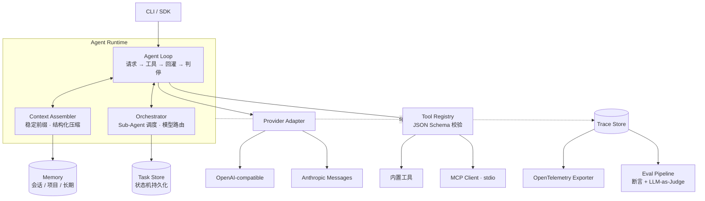

# Prism

> A trace-first agent harness in Go — every run is traceable, replayable and measurable.

Prism 是一个轻量、Provider 无关的 Agent Harness。它和大多数 Agent 框架的区别只有一句话：

**这里的每一次 Agent 运行，都能被完整追踪、复现和度量。**

Agent 应用真正难的地方不在于"跑起来"——接上一个模型、注册几个工具，一个下午就能跑通。
难的是跑起来之后：这次为什么多花了三倍 Token？上下文压缩之后模型为什么忘了关键约束？
换个模型成功率是涨了还是跌了？多个子 Agent 一起干活，出了问题该赖谁？

大多数框架把这些问题留给日志。Prism 把它们做成一等公民：Trace 是核心数据结构，
评测流水线直接消费 Trace，而不是另起一套埋点。

> **项目状态**：开发中。下面标注 ✅ 的模块已可用，⬜ 的仍在实现。
> 完整清单见 [ROADMAP.md](ROADMAP.md)。

## 设计目标

| 目标 | 具体含义 |
|---|---|
| Provider 无关 | 统一的消息、工具调用、用量与错误模型，OpenAI / Anthropic 协议差异收敛在适配层 |
| 全链路可观测 | 模型调用、工具执行、上下文压缩、模型路由各自成 span，按 OpenTelemetry 语义约定导出 |
| 可度量 | 场景化评测集 + 规则断言 + LLM-as-Judge，一条命令产出版本间对比报告 |
| 零运维依赖 | SQLite 单文件承载会话、任务、记忆与 Trace，不引入外部中间件 |

## 架构



## 模块

### 1. Agent Loop 与工具执行 ⬜

Provider 无关的主循环：请求模型 → 解析 tool_use → 执行工具 → 结果回灌 → 判停。
同一轮内的多个工具调用并发执行、按原顺序回灌。

工具在 Registry 按名注册并自带 JSON Schema，调用前校验入参；**校验失败作为工具错误
回灌给模型，而不是中断循环**——模型有机会自己改正参数重试，这是 Agent 能自愈的关键。

MCP Client 走 stdio transport，启动时 `list_tools` 并入 Registry；Server 挂掉时只摘除
该组工具，不影响整体运行。

两家 Provider 的 rate limit、上下文超限、内容拦截、网络错误被映射到同一组错误码，
上层据此决定重试、降级还是中止。

### 2. 上下文工程与分层记忆 ⬜

**KV Cache 友好的装配顺序。** 缓存是严格前缀匹配的：从第一个 token 起逐个比对，
中间任何一个 token 变了，从那里往后全部失效。所以装配顺序固定为

```
系统提示 → 工具定义 → 长期记忆 → 历史消息 → 本轮输入
```

并在实现上强制三条约束：系统提示中不出现时间戳等每次都变的内容；工具定义稳定排序
（MCP Server 动态加载导致的顺序抖动足以让整个缓存作废）；压缩历史时整段替换靠前的历史，
不零散删中间几轮。命中率取自响应 `usage` 的 `cache_read_input_tokens` /
`cache_creation_input_tokens`，直接落进 span 属性。

**结构化压缩而非截断。** 超出 Token 预算时产出结构化摘要（已完成的事 / 未完成的任务 /
关键文件与路径 / 关键结论）并保留最近 N 轮原文。摘要是有 schema 的对象，因此可以被
评测断言检查——"压缩之后有没有丢掉待办"是个可测的问题。

**工具输出分级留存。** 读大文件、命令刷屏这类大体量结果不整段回灌，只回灌结构化摘要
和一个可回取的 ID，原文落盘，模型确有需要时用 `fetch_output(id, range)` 按需回取。
长会话里上下文膨胀的头号来源是工具输出而非对话历史，这条比压缩历史更早生效。

**三层记忆。** 会话内（本次 run）/ 项目级（同一 workspace）/ 长期（跨项目偏好），
写入时机与生命周期各不相同，统一落 SQLite，用 BM25（FTS5）+ 向量余弦混合召回，
注入位置固定在稳定前缀之后、历史之前。

### 3. Multi-Agent 编排与任务调度 ⬜

采用 **Orchestrator-Worker（主从）**结构。主 Agent 通过 `spawn_task` 委派任务，
子 Agent 拥有独立上下文和独立工作区（git worktree，改动可 diff 可回滚），主循环不阻塞等待。

子任务完成后**只把结构化结果回灌主上下文**（结论 + 改动文件列表 + 失败原因），
完整执行轨迹留在子 trace 里按需查看。Sub-Agent 存在的根本理由不是并发，
而是让一个几十轮的子任务在主上下文里只留下一段结论。

同一任务可以 fan-out 多路策略（不同模型 / 不同提示 / 不同工具集）并行求解，
主 Agent 按断言或评分比对后选优——副产品是多条可直接对比的 Trace，天然接入评测流水线。

任务状态机（queued / running / succeeded / failed / cancelled）与中间产物持久化到 SQLite，
进程重启后可恢复，支持查询进度、主动取消与失败重试。模型路由按任务复杂度选择模型，
**路由决策的原因一并写进 Trace**，事后可解释。

### 4. 可观测性与评测 ⬜

一次 run 是一个 trace；每次模型调用、工具调用、上下文压缩、模型路由各是一个 span：

```jsonc
{
  "trace_id": "01JBX…",
  "span_id":  "…",
  "name":     "gen_ai.chat",
  "attributes": {
    "gen_ai.system":                     "anthropic",
    "gen_ai.request.model":              "claude-sonnet-5",
    "gen_ai.usage.input_tokens":         12480,
    "gen_ai.usage.output_tokens":        326,
    "gen_ai.usage.cache_read_tokens":    11904,
    "prism.route.reason":                "complexity=low, fallback_from=opus",
    "prism.agent.role":                  "worker",
    "prism.agent.parent_span":           "…"
  },
  "duration_ms": 2841,
  "status": "ok"
}
```

按 OpenTelemetry `gen_ai.*` 语义约定导出，同时落一份 SQLite 便于本地查询。
给定 trace id 可以重放整轮执行的时间线。

因为每个 Agent 的耗时、Token 成本和失败原因都挂在各自 span 上，可以直接回答
**哪个 Agent 拖慢了整体、谁烧掉了大部分预算、失败根因在哪一层**——多智能体系统公认最痛的
就是出问题不知道该赖谁。

评测侧：20–30 个场景化用例（改代码 / 查信息 / 多步任务 / 工具失败重试），
每例带规则断言（文件是否被正确修改、命令退出码、输出是否含关键字）与 LLM-as-Judge 打分，
一条命令跑全量回归，输出任务成功率、平均步数、平均 Token 成本、P50/P95 延迟，
并支持两个版本或两个模型的对比报告。

## 技术选型

| 层 | 选型 | 理由 |
|---|---|---|
| Runtime | Go | 并发模型贴合"同轮多工具并发 + 多 Sub-Agent 调度"，单二进制分发 |
| 存储 | SQLite（FTS5 + embedding BLOB） | 单文件零运维，会话 / 任务 / 记忆 / Trace 全部落它 |
| 工具协议 | MCP（stdio） | 生态现成，无需为每个外部能力写一次适配 |
| 可观测 | OpenTelemetry 语义约定 | vendor-neutral，可直接接入既有观测后端 |

## 明确不做的事

克制比功能更需要理由，所以逐条写下来：

- **不做可视化工作流编排画布。** 那是低代码平台的赛道，与"给开发者用的 harness"定位冲突。
- **不套模型网关。** Provider 适配层直接内建，少一跳、少一个故障点、少一处版本漂移。
- **不做对等 Swarm 多 Agent。** Token 成本随 Agent 数量组合爆炸、决策路径不可复现、
  失败后无法定位是哪一跳出的问题——这与 trace-first 的定位直接冲突。只做主从。
- **不引入向量数据库，也暂不上 sqlite-vec。** embedding 以 BLOB 存在记忆表里，
  查询时全量算余弦：几千条 × 1024 维 float32 约十几 MB，内存里暴力扫是毫秒级，
  比维护一套索引更快、还少一个依赖。**升级路径**：记忆量级到十万条时换 sqlite-vec，
  再往上才轮得到独立向量库。
- **不追求全插件化。** 核心 Loop 保持可读，扩展点只开在 Provider、Tool、Exporter 三处。

## 相关项目

| 项目 | 借鉴 | Prism 的取舍 |
|---|---|---|
| Claude Code | Hooks 生命周期、compact 上下文策略 | 压缩产物是结构化 schema，可被评测断言检查 |
| pi (`pi-telemetry`) | vendor-neutral 遥测契约 | 遥测与评测打通，Trace 直接喂给回归流水线 |
| DeepSeek Harness | 插件化架构 | 只在三处开扩展点，核心 Loop 保持可读 |
| jcode | 语义向量记忆、Swarm | 记忆分层更简单，先证明必要性再上索引；不做对等 Swarm |

## 快速开始

```bash
go build ./cmd/prism
./prism --help
```

## License

[MIT](LICENSE)
